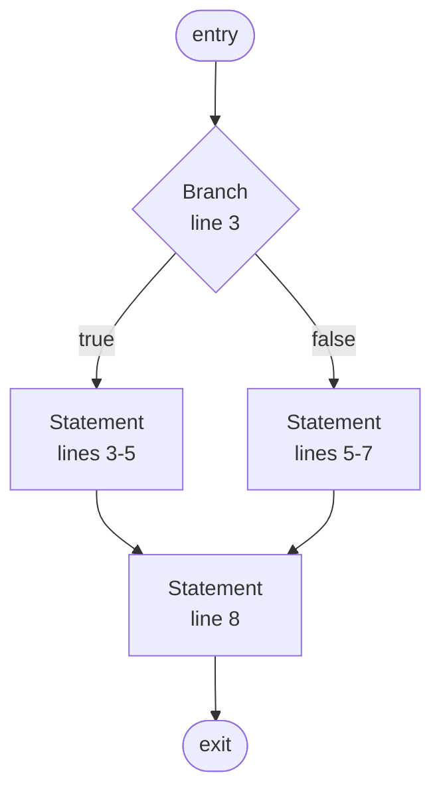

# normalize cfg

Build and render the control flow graph for a function. Visualizes execution paths, branches, and loops.

```
normalize cfg <file> [-f <function>] [--format mermaid]
```

## Arguments

| Argument | Description |
|----------|-------------|
| `<file>` (positional) | Source file to analyze |
| `-f <function>` | Function name filter (defaults to first function found) |
| `--format` | Output format: `mermaid` (default) |

## Output

Renders a Mermaid `flowchart TD` diagram of the function's control flow. Block shapes:

| Shape | Meaning |
|-------|---------|
| `([label])` | Entry / Exit (stadium) |
| `[label]` | Statement, LoopBody, LoopExit, Unreachable |
| `{label}` | Branch (if/match head), LoopHead |
| `[/label\]` | Catch/except block |

Edge labels: `true`, `false`, `back`, `break`, `continue`, `return`, `exception`, `exception: <Type>` (when exception type is known).

## Supported languages

Rust, Python, Go (additional languages via external `.cfg.scm` query files).

## Example

```
normalize cfg src/lib.rs -f my_function
```

Output:


